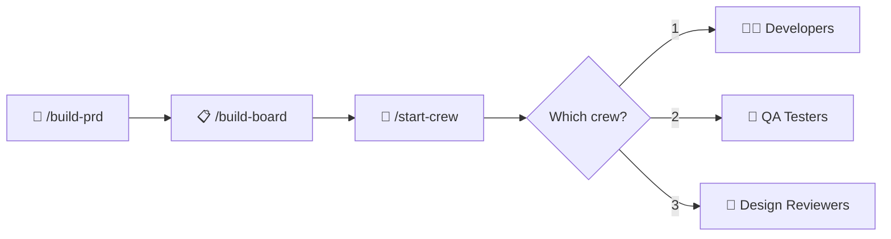
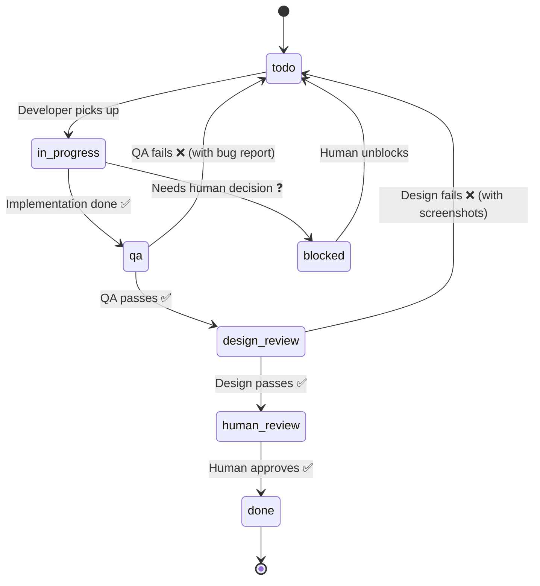
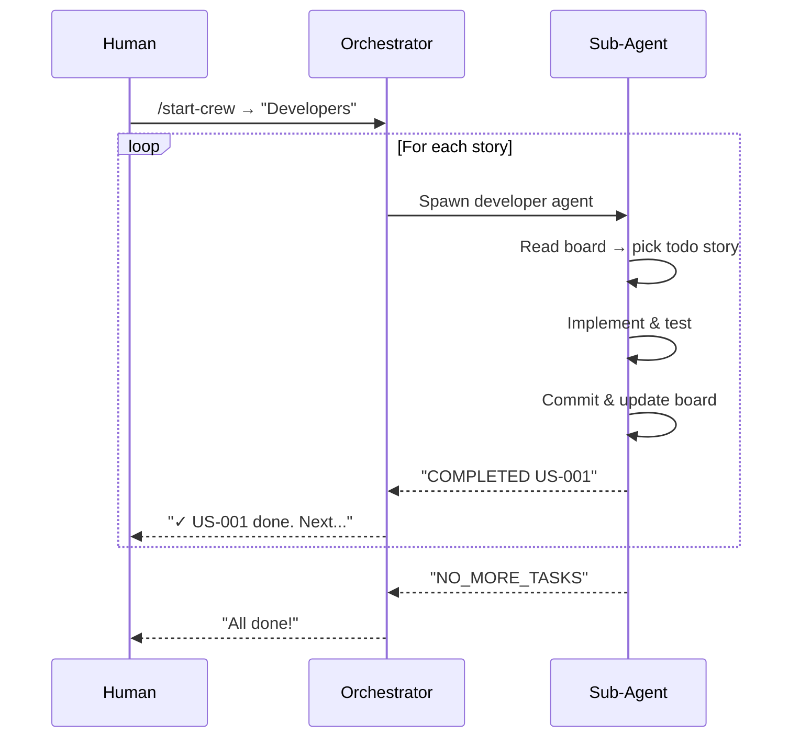
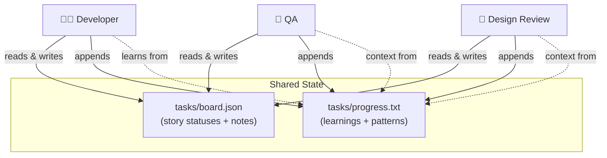

# Claude Crew

An agentic workflow system for Claude Code that orchestrates AI sub-agents to build features autonomously — from PRD to production-ready code with QA and design review.

You define the feature. Claude Crew breaks it into user stories, then developer, QA, and design-review agents work through them one by one until everything is implemented, tested, and visually verified.

---

## How It Works

```
┌─────────────────────────────────────────────────────────────┐
│                        YOU (Human)                          │
│                                                             │
│   1. /build-prd    → describe your feature                  │
│   2. /build-board  → convert PRD into task board            │
│   3. /start-crew   → pick a crew and let them work          │
│                                                             │
└─────────────────────────────────────────────────────────────┘
```

### The Pipeline



### Story Lifecycle

Each user story flows through this status pipeline:



### Agent Loop (per crew type)



---

## Installation

### Option 1: Copy into your project

```bash
# Clone the repo
git clone https://github.com/mare22/claude-crew.git

# Copy skills and agents into your project
cp -r claude-crew/.claude/skills/ your-project/.claude/skills/
cp -r claude-crew/.claude/agents/ your-project/.claude/agents/
```

### Option 2: Use as a reference

Browse the files and adapt the agent prompts to your workflow.

### Prerequisites

- [Claude Code](https://claude.com/claude-code) CLI installed

#### Required: Playwright Plugin

The QA and Design Review agents use Playwright for browser automation. Install the official plugin:

```bash
# Inside Claude Code, run:
/install playwright
```

This installs the `playwright` plugin from the official marketplace, which provides the `playwright-cli` skill for browser interaction (navigation, clicking, screenshots, etc.).

If you prefer to install `playwright-cli` as a standalone npm tool:

```bash
npm install -g playwright-cli
```

#### Recommended: Frontend Design Plugin

The Developer agent uses this skill for guidance when implementing UI stories. It helps produce distinctive, polished interfaces instead of generic AI-generated designs.

```bash
# Inside Claude Code, run:
/install frontend-design
```

This installs from the `claude-code-plugins` marketplace.

#### Verify Installation

After installing, restart Claude Code and run `/agents` to confirm the three claude-crew agents are loaded: `developer`, `qa`, `design-review`.

---

## Usage

### Step 1: Create a PRD

```
/build-prd
```

Describe your feature. The skill asks clarifying questions, then generates a structured PRD at `tasks/prd-[feature-name].md`.

**Example:**
```
/build-prd Add a task priority system with high/medium/low levels, visual indicators, and filtering
```

### Step 2: Create the Board

```
/build-board
```

Converts your PRD into `tasks/board.json` — a structured task board with small, dependency-ordered user stories. Also initializes `tasks/progress.txt` for cross-agent learnings.

**Example output (`tasks/board.json`):**
```json
{
  "project": "TaskApp",
  "prdSource": "tasks/prd-task-priority.md",
  "description": "Task Priority System",
  "userStories": [
    {
      "id": "US-001",
      "title": "Add priority field to tasks table",
      "acceptanceCriteria": ["Add priority column...", "Typecheck passes"],
      "priority": 1,
      "status": "todo",
      "notes": ""
    }
  ]
}
```

### Step 3: Run the Crew

```
/start-crew
```

The orchestrator asks which crew to run:

```
What crew do you want to run?

1. Developers    — pick "todo" stories, implement, move to "qa"
2. QA Testers    — pick "qa" stories, test in browser, move to "design-review"
3. Design Review — pick "design-review" stories, check visuals, move to "human-review"
```

Run each crew in a **separate session**:

```
# Session 1: Run developers until all stories are implemented
/start-crew → 1

# Session 2: Run QA on implemented stories
/start-crew → 2

# Session 3: Run design review on QA-passed stories
/start-crew → 3
```

### Step 4: Monitor Progress

Open the visual board to see story statuses in real-time:

```bash
# Serve the tasks directory and open the board
npx serve tasks/
# Then open http://localhost:3000/board.html

# Or with Python
python3 -m http.server -d tasks/ 8080
# Then open http://localhost:8080/board.html
```

The board auto-refreshes every 5 seconds, so you can watch stories move across columns as agents work.

If you can't run a server, open `tasks/board.html` directly in a browser and drag-and-drop `board.json` onto the page.

### Step 5: Human Review

Stories that pass both QA and design review land in `"human-review"` status. Open `tasks/board.json`, check the work, and set status to `"done"` when satisfied.

---

## Architecture

### File Structure

```
your-project/
├── .claude/
│   ├── agents/                    # Sub-agent definitions
│   │   ├── developer.md           # TDD developer agent
│   │   ├── qa.md                  # Functional QA tester
│   │   └── design-review.md       # Visual design reviewer
│   └── skills/                    # Slash command skills
│       ├── build-prd/SKILL.md     # /build-prd
│       ├── build-board/SKILL.md   # /build-board
│       └── start-crew/SKILL.md    # /start-crew orchestrator
└── tasks/                         # Generated at runtime
    ├── prd-[feature].md           # PRD document
    ├── board.json                 # Task board (source of truth)
    ├── board.html                 # Visual kanban board (auto-refreshes)
    └── progress.txt               # Progress log & codebase patterns
```

### Agent Details

#### Developer Agent

```
Reads: CLAUDE.md → progress.txt (patterns) → board.json → PRD
Does:  Pick todo story → Write tests → Implement → Quality checks → Commit
Moves: todo → qa
Skills: playwright-cli, frontend-design
```

- Uses **TDD** for logic stories (write failing test first)
- Uses **browser verification** for UI stories (via playwright-cli)
- Skips tests when they don't make sense (migrations, config, CSS)
- Appends learnings to `progress.txt` so future agents benefit

#### QA Agent

```
Reads: board.json → PRD → progress.txt
Does:  Pick qa story → Test each acceptance criterion in browser
Moves: qa → design-review (UI) or qa → human-review (backend)
       qa → todo (if failed, with bug report + screenshots)
Skills: playwright-cli
```

- Tests happy-path functionality against acceptance criteria
- Takes screenshots as evidence
- Checks for auth.json before testing authenticated pages
- **Never writes application code**

#### Design Review Agent

```
Reads: board.json → PRD → progress.txt
Does:  Pick design-review story → Screenshot at 3 viewports → Check visuals
Moves: design-review → human-review
       design-review → todo (if failed, with screenshots + fix instructions)
Skills: playwright-cli
```

- Tests at Desktop (1920x1080), Tablet (768x1024), Mobile (375x812)
- Checks: layout, colors, typography, spacing, dark/light theme
- Catches common CSS bugs: off-screen elements, overlapping content, broken responsive
- **Never writes application code** — sends back with specific fix instructions

### How Agents Communicate

Agents don't talk to each other directly. They communicate through two files:



- **`board.json`** is the source of truth for story statuses. Agents update it after completing work.
- **`progress.txt`** accumulates institutional knowledge. Each agent reads the "Codebase Patterns" section before starting, and appends learnings after finishing. This is how a developer agent in iteration #5 knows about gotchas discovered in iteration #1.

---

## Handling Failures

### Developer gets blocked

```
Developer: "BLOCKED: US-003 - Unclear which API endpoint to use for notifications"
Orchestrator stops → asks you → you answer → orchestrator resumes
```

### QA finds a bug

```
Board update:
  US-003 status: "todo"
  US-003 notes: "QA FAILED: Submit button returns 500 error. Screenshot: qa-fail-US-003.png"

Next developer run picks it up and fixes it.
```

### Design review finds CSS issues

```
Board update:
  US-003 status: "todo"
  US-003 notes: "DESIGN REVIEW FAILED:
    - Card overflows viewport on mobile (375px). See design-issue-US-003-mobile.png
    FIX: Add max-width: 100% and overflow-x: hidden to .card container"

Next developer run picks it up with clear fix instructions.
```

---

## Tips

- **Run devs first, then QA, then design review** — each crew type in its own session
- **Check `tasks/progress.txt`** to see what agents learned — useful patterns accumulate there
- **Stories should be small** — one focused change per story, completable in one agent context window
- **Board is the source of truth** — if you want to re-prioritize or skip stories, edit `board.json` directly
- **Human-review is your checkpoint** — nothing ships without your approval

---

## License

MIT
